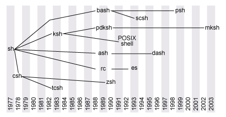

# Introduction to the Bash Command line

## Introduction
Shell is both a command interpreter and a programming language


**Why use Shell?**

- To utilize Git Version Control
- Use of Package management tools to install packages(APT for Ubuntu, PIP for Python, NPM for Javascript): Package is just resusable piece of software
- It allows to do stuff faster than GUI(example: Consider a case where you have a picture from camera, that's say 12MP large. You want to resize it to 1024x768 to upload it to a social media site.)

```
$ convert D:/DCIM/Camera/IMAGE10001.jpg -resize 1024x768 C:/Users/TorrentPrincess/Pictures
```
So you open up photoshop, go File->Open..., navigate to where your image is (double click My Computer, Disk D:, DCIM, Camera, find image file and double click it), then you go Image->resize, ecter 1024 and 768, then OK, then File->Save as..., select destination, click OK, then close Photoshop.

- It supports automation of repeated tasks(example: looping over a set of images in order to resize them to be uploaded to a social media site)
- Helps in becoming an efficient programmer
- Eventually it will become fun!


**Evolution of Shells**

- Ken Thompson (of Bell Labs) developed the first shell for UNIX called the V6 shell in 1971. 
- What the Thompson shell lacked was the ability to script. 
- Its sole purpose was as an interactive shell (command interpreter) to invoke commands and view results
- The Bourne shell(./bin/sh) was created by Stephen Bourne in 1977 at AT&T Bell Labs for V7 UNIX
- The Bourne shell had two primary goals: 
    * serve as a command interpreter to interactively execute commands for the operating system
    * scripting (writing reusable scripts that could be invoked through the shell)
- The Bourne shell was anchor for numerous derivate shells(Ksh,Csh,Bash)-Refer image below.
- Bash is a superset of the Bourne shell
- Bash is the default shell for the GNU operating system. 
- It currently runs on nearly every version of Unix and a few other operating systems - independently-supported ports exist for MS-DOS, OS/2, and Windows platforms.

figure1: lineage of shells



## Navigating through your file system

```
pwd #find out what directory you are in
ls #to get a listing of the files in your current location
man -ls #understand the flags, windows users use help
ls *.txt #search files matching a specific pattern
cd #explore the change directory command
```

**Test your understanding**

from the current location, navigate to the root location for linux users or desktop folder for windows users. list the files using the following arguments:
- use a long listing format
- sort by file size, largest first

*hint: use the man -ls to get the list of allowed arguments*


## Interacting with Files

##### Reading files

```
mkdir IntroShell-Text #create a new directory to engage with text files
cd IntroShell-Tex #or simply cd.. or cd IntroS with then hit tab to auto-complete
wget http://www.gutenberg.org/files/2600/2600-0.txt 
ls -lh #to check if the file is available
code pg2600-0.txt #open the file using the program Visual Studio Code
cat pg2600-0.txt #read the file within the command line environment
head pg2600-0.txt #read the head of the file
tail pg2600-0.txt #read the tail of the file
mv pg2600-0.txt mytext.txt #rename the file
```

##### Editing files


## Perform basic data manipulation tasks such as combining and copying files

##### Combining files

```
cp pg2600-0.txt tolstoy.txt #duplicate a file
cp tolstoy.txt tolstoy2.txt #to combine
cat tolstoy.txt tolstoy2.txt #to combine files but prints the output within the shell
cat tolstoy.txt tolstoy2.txt > tolstoy-twice.txt #send the output to a newfile
cat *.txt > everything-together.txt #combining more than two files
```

##### Coping and Moving files

basic format of the copy command: cp [source] [destination]  
if you dont want to leave a copy behind, replace cp with mv


```
cp tolstoy.txt tolstoy-backup.txt #create a backup
cp /home/asela/Documents/tolstoy.txt /home/asela/Downloads/ #move a file
cp /home/asela/Documements/*.txt /home/asela/Downloads/ #move several files at once
cp /home/asela/Downloads/tolstoy.txt ./ # command refers to the current directory you are in
```

##### Deleting files


*references*

1. Evolution of shells in Linux https://www.ibm.com/developerworks/linux/library/l-linux-shells/index.html
2. Bash reference manual https://www.gnu.org/software/bash/manual/bash.html#What-is-Bash_003f
3. Introduction to the Bash Command line https://programminghistorian.org/en/lessons/intro-to-bash