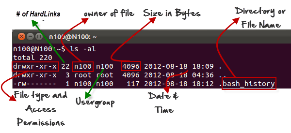
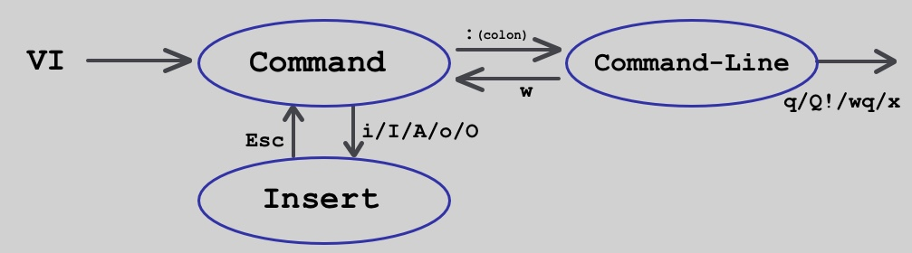

# Introduction to the Bash Command line


## <span style="color:blue">Section 1</span>: Introduction
Shell is both a command interpreter and a programming language


<span style="color:green">**Why use Shell?**</span> 

- To utilize Git Version Control
- Use of Package management tools to install packages(APT for Ubuntu, PIP for Python, NPM for Javascript): Package is just resusable piece of software
- It allows to do stuff faster than GUI(example: Consider a case where you have a picture from camera, that's say 12MP large. You want to resize it to 1024x768 to upload it to a social media site.)

```
$ convert D:/DCIM/Camera/IMAGE10001.jpg -resize 1024x768 C:/Users/TorrentPrincess/Pictures
```
    
>So you open up photoshop, go File->Open..., navigate to where your image is (double click My Computer, Disk D:, DCIM, Camera, find image file and double click it), then you go Image->resize, ecter 1024 and 768, then OK, then File->Save as..., select destination, click OK, then close Photoshop.

- It supports automation of repeated tasks(example: looping over a set of images in order to resize them to be uploaded to a social media site)
- Helps in becoming an efficient programmer
- Eventually it will become fun!


<span style="color:green">**Evolution of Shells**</span>

- Ken Thompson (of Bell Labs) developed the first shell for UNIX called the V6 shell in 1971. 
- What the Thompson shell lacked was the ability to script. 
- Its sole purpose was as an interactive shell (command interpreter) to invoke commands and view results
- The Bourne shell(./bin/sh) was created by Stephen Bourne in 1977 at AT&T Bell Labs for V7 UNIX
- The Bourne shell had two primary goals: 
    * serve as a command interpreter to interactively execute commands for the operating system
    * scripting (writing reusable scripts that could be invoked through the shell)
- The Bourne shell was anchor for numerous derivate shells(Ksh,Csh,Bash)-Refer image below.
- Bash is a superset of the Bourne shell
- Bash is the default shell for the GNU operating system. 
- It currently runs on nearly every version of Unix and a few other operating systems - independently-supported ports exist for MS-DOS, OS/2, and Windows platforms.

figure1: lineage of shells


## <span style="color:blue">Section 2</span>: Navigating through your file system

```
pwd #find out what directory you are in
ls #to get a listing of the files in your current location
man -ls #understand the flags, windows users use help
ls *.txt #search files matching a specific pattern
cd #explore the change directory command
```

<span style="color:red">**Test your understanding**</span> 

from the current location, navigate to the root location for linux users or desktop folder for windows users. list the files using the following arguments:
- use a long listing format
- sort by file size, largest first

*hint: use the man -ls to get the list of allowed arguments*


## <span style="color:blue">Section 3</span>: Interacting with Files

##### Reading files

```
mkdir IntroShell-Text #create a new directory to engage with text files
cd IntroShell-Tex #or simply cd.. or cd IntroS with then hit tab to auto-complete
wget http://www.gutenberg.org/files/2600/2600-0.txt 
ls -lh #to check if the file is available
mv 2600-0.txt pg2600-0.txt #rename the file
code pg2600-0.txt #open the file using the program Visual Studio Code
cat pg2600-0.txt #read the file within the command line environment
head pg2600-0.txt #read the head of the file
tail pg2600-0.txt #read the tail of the file
```

Understanding the various components of a ls -al command




##### Editing files

Vim is a powerful text editor; it has a steep learning curve



Command-line mode
```
q [Enter]If you haven't made any modifications, or have already saved them beforehand.
quit [Enter]If you haven't made any modifications, or have already saved them beforehand.
q! [Enter]ignore any modifications and quit.
w [Enter]Save and return to Command mode.
wq [Enter]Save and quit.
x [Enter]Save and quit, same as wq 
```

<span style="color:red">**Test your understanding**</span>  

Extract the text file 2600-0.txt using wget;open the file, change the content "Title: War and Peace" to "Title_main: WAR AND PEACE", save and quit using the VIM text editor.


## <span style="color:blue">Section 4</span>: Perform basic data manipulation tasks such as combining and copying files

##### Combining files

```
cp pg2600-0.txt tolstoy.txt #duplicate a file
cp tolstoy.txt tolstoy2.txt #to combine
cat tolstoy.txt tolstoy2.txt #to combine files but prints the output within the shell, cat is for concatenation
cat tolstoy.txt tolstoy2.txt > tolstoy-twice.txt #send the output to a newfile
cat *.txt > everything-together.txt #combining more than two files
```

##### Coping and Moving files

basic format of the copy command: cp [source] [destination] 

if you dont want to leave a copy behind, replace cp with mv


```
cp tolstoy.txt tolstoy-backup.txt #create a backup
cp /home/asela/Documents/tolstoy.txt /home/asela/Downloads/ #move a file
cp /home/asela/Documements/*.txt /home/asela/Downloads/ #move several files at once
cp /home/asela/Downloads/tolstoy.txt ./ # command refers to the current directory you are in
```

##### Deleting files

Basic formats of remove command: rm {file-name} 
                                 rm [options] {file-name} 
                                 rm -f {file-name} # -f is used to remove the file forcefully 
```
rm /d/thushara/workspace/tolstoy.txt # remove a file
rm -i /d/thushara/workspace/tolstoy.txt # remove a file with a yes/no prompt: where i stands for inquire
rm /d/thushara/workspace/tolstoy-001.txt /d/thushara/workspace/tolstoy-002.txt /d/thushara/workspace/tolstoy-003.txt # remove multiple files at one time
rm /d/thushara/workspace/*.txt # remove all text (.txt) files in the current directory
rm -rf /d/thushara/workspace/xyz # remove all files and subdirectories from a directory
rmdir /d/thushara/workspace/xyz # remove an empty directory 

```          

<span style="color:red">**Test your understanding**</span>  
make a new directory and name it as MYSHELL. move the 2600-0.txt to the new directory you have created.
check if the file exists. delete the file. 

## <span style="color:blue">Section 5</span>:  Bash Scripting

```
cat /etc/shells # see what shells you have installed
which bash #find out where is your bash interpreter
touch myscript.sh #create an empty script file
vim myscript.sh #open the script file using vim

#insert the following text and save the file as myscript.sh
#!/bin/bash
{insert script}

chmod +x myscript.sh #make the file executable
./myscript.sh #execute the file

curl wttr.in #weather forecast in your terminal!

```

Granting permissions using the chmod command:


**why do you need to put #!/bin/bash at the beginning of a script file**?
- called "hash-bang", "she-bang" or "sha-bang"
- should be followed by a file path of an interpreter(tells what program to use it to run it)
- if not specified, the default interpreter will be invoked(echo $SHELL outputs the path to the default interpreter)
- used as a convention
- used for portability


<span style="color:red">**Test your understanding**</span>  
create a script and prompt the user to input a name. store the name into a variable. print the name to the console


*references*
1. Evolution of shells in Linux https://www.ibm.com/developerworks/linux/library/l-linux-shells/index.html
2. Introduction to the Bash Command line https://programminghistorian.org/en/lessons/intro-to-bash
3. GNU Coreutils
https://www.gnu.org/software/coreutils/manual/coreutils.html#toc-Introduction-1
4. Bash reference manual https://www.gnu.org/software/bash/manual/bash.html#What-is-Bash_003f
5. The vi editor (Visual editor) - A quick reference guide
https://ss64.com/vi.html
6. ls -la output screen capture - http://sapbasisnetweaverguide.blogspot.com/2016/03/some-simple-unix-commands-used-for-sap.html
7. granting permssions using chmod - 
https://blog.perlubantuan.com/chmod-file-permissions-code/
8. ‘wget’ is not recognized as an internal or external command – Windows Fix
https://w3guy.com/wget-recognized-internal-external-command-windows-fix/
9. adding a directory to PATH Environment variable in Windows
https://stackoverflow.com/questions/9546324/adding-directory-to-path-environment-variable-in-windows